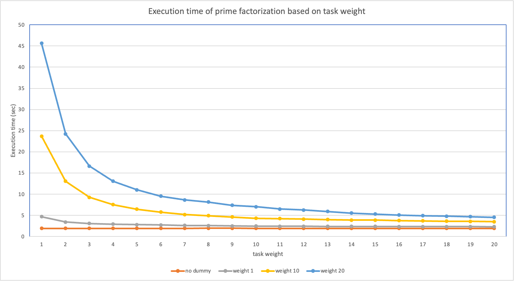

# Weighted Round-Robin (WRR) Scheduler

This project implements a weighted round-robin(WRR) scheduler.

## Build & Execute Commands
### Kernel
```shell
sudo ./build-rpi3.sh
sudo ./setup-images.sh
```

### Turnaround Time Test
```shell
test/compile-mount-and-copy.sh
./qemu.sh

# in QEMU
./dummy 20 0    # dummy at CPU 0
./dummy 20 1    # dummy at CPU 1
./dummy 20 2    # dummy at CPU 2
./dummy 20 3    # dummy at CPU 3
./test          # turnaround time test
```

## WRR Scheduler Class
### Data Structures
Some structs are added for representing WRR information.

#### `struct sched_wrr_entity`
It contains WRR-related information of a task.
```c
struct task_struct {
    ...
    struct sched_wrr_entity		wrr;
    ...
}
```
```c
struct sched_wrr_entity {
	unsigned int weight;
	unsigned int time_slice;
	struct list_head run_list;
	unsigned short on_rq;
};
```
- `weight`: weight of the task.
- `time_slice`: remaining ticks for execution.
- `run_list`: list node used in a runqueue.
- `on_rq`: 1 if task is on a runqueue, 0 otherwise.

#### `struct wrr_rq`
It represents runqueue of WRR scheduler.
```c
struct rq {
    ...
    struct wrr_rq 		wrr;
    ...
}
```
```c
struct wrr_rq {
	struct list_head queue;
	unsigned int nr_running;
	unsigned int total_weight;
};
```
- `queue`: the first node of the runqueue list.
- `nr_running`: number of running tasks.
- `total_weight`: total weight of tasks on the runqueue.

### WRR Scheduler Class: `wrr_sched_class`
`wrr_sched_class` locates in `kernel/sched/wrr.c`. Necessary scheduler interface functions are implemented for the WRR scheduler:
- `enqueue_task_wrr()`: enqueue a task to the WRR runqueue.
- `dequeue_task_wrr()`: dequeue a task from the WRR runqueue.
- `yield_task_wrr()`: requeue the current WRR task when yielding.
- `pick_next_task_wrr()`: pick the next task to execute from the WRR runqueue.
- `put_prev_task_wrr()`: requeue the previous WRR task on the runqueue.
- `select_task_rq_wrr()`: select a CPU with minimum total weight to exeucte a task.
- `update_curr_wrr()`: update statistics of the current WRR task.
- `task_tick_wrr()`: update timeslice of the current WRR task at every tick.
- `get_rr_interval_wrr()`: return the WRR timeslice based on task's weight.

WRR scheduler replaces the default CFS scheduler:
- `kernel/sched/rt.c`
  - RT scheduler(`rt_sched_class`) points the WRR scheduler, instead of the CFS scheduler.
- `kernel/sched/core.c`
  - `sched_init()` initializes the WRR runqueue at scheduler initialization.
  - `init_idle()` initializes `struct sched_wrr_entity` of the idle process(`swapper`).
  - `sched_fork()` initializes `struct sched_wrr_entity` of the new task, and assigns it to the WRR scheduler if it follows neither DL or RT policy.
  - `rt_mutex_setprio()` assigns all normal tasks to the WRR scheduler.
  - `sched_setscheduler()` assigns all normal tasks to the WRR scheduler, and set the task's weight to default when newly scheduled as WRR.
  - `normalize_rt_tasks()` set the task's scheduler policy to WRR.
- `init/init_task.c`
  - `init_task` is assigned to the WRR scheduler.
- `kernel/kthread.c`
  - `kthread` is assigned to the WRR scheduler.

### WRR System calls
There are system calls to update and query the weight of a WRR task.
- `sched_setweight(pid, weight)`: set the weight of a WRR task.
- `sched_getweight(pid)`: return the weight of a WRR task.

## Load Balancing


## Turnaround Time Test

- We take prime number `300000007` to prime factorization target number 
- All test repeated 5 times and we measured average of the execution time.

First, we executed prime factorization `test` alone. As a result, because there's rare interrupt to test, execution time was around 1.9 secs regardless of task weight

So, we decided to run spinning `dummy` tasks at background to all `CPU`s. Then run `test` and measured execution time. we did 3 trials with different `dummy` weight, 1, 10 and 20.

The graph below shows excution time based on task weight.
- The color of graph is differentiated by weight of dummy task.



## Lessons Learned